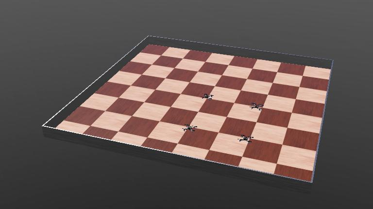

# DroneBlocks CrazyFlie Webots Robot Utilities


## Install locally

```shell
pip install path/to/dir
```

## Webots Crazyflie Swarm Example


Example of using the Webots Emitter/Receiver devices to allow one drone to control the other drones.

The lead drone, called the queen, will send its flying instructions to the other drones, called workers.  This will keep the flying formation constant as the queen drone flys around.

The queen drone is the one that is named `EMIT-...`.  This is the drone that will `emit` its flying instructions to the other drones.

The queen is identified by using the Robot `controllerargs` property and passing the string `queen`.

The worker drones are the ones that are named `RCVn-...`.  These are the drones that will listen for flying instructions from the queen drone.

They are identified by using the Robot `controllerargs` property set to worker.

If you do not set `queen` or `worker` in the controllerags, then the drone is a standalone drone that can be controlled individually by the keyboard commands.
